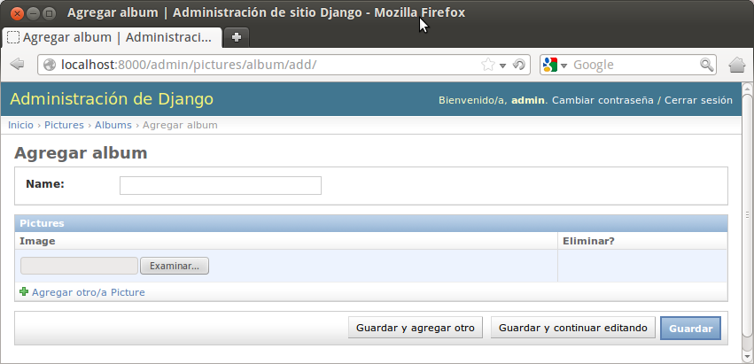

# Haciendo la cola con django
---

# Algún ejemplo trillado

Hagamos un fotolog!!

    #models.py
    from django.db import models

    
    class Album(models.Model):

        name = models.CharField(max_length=100)
        
        
    class Picture(models.Model):

        image = models.ImageField(upload_to='images')
        album = models.ForeignKey('pictures.Album')

---
# Algún ejemplo trillado

Hagamos un fotolog!!
    
    #admin.py
    from django.contrib import admin
    from models import Album, Picture

    class PictureInline(admin.TabularInline):

        model = Picture
        extra = 1

    class AlbumAdmin(admin.ModelAdmin):

        inlines = [PictureInline]
        

    admin.site.register(Album, AlbumAdmin)
    admin.site.register(Picture)

---
# Listo!

---

#Listo!
Hasta que aparece el cliente y:

> EHHH, tengo que cargar las fotos de a una‽
---
# Iteramos!

    #models.py
    from django.db.models.signals import post_save

    ...

---
# Iteramos!

Hay que hacer algo con ese zip
---

# Señales!

Nos permite atar funciones a eventos determinados *eventos*

    #models.py
    from django.dispatch import receiver
    from django.db.models.signals import post_save

    ...

    @reciever(post_save, sender=Album)
    def process_attach(sender, instance, created, **kwargs):
        
        #Descomprimimos el zip y creamos instancias de Pictures y cosas así...
        ...
---
# Ahora si, Listo

---
# Mientras tanto, del lado del usuario...

        
        
- Pedidos
- Respuestas
- Procesamiento
- Latencia
---

# Soluciones comunes

## Concurrencia!

Shared memory:
- Hilos
- Semaforos

> Global Intepreter Lock, o "Como el manejo de hilos de python apesta"

Message Passing:

- Procesos
- Colas de Tareas/Mensajes
- Computación distribuida

---

# Herramientas

