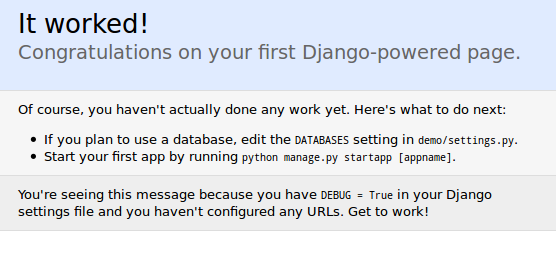
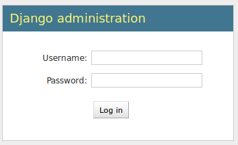

# Django para todos
---

# Django para todos

Django es un framework, escrito en python, para desarrollo web
---

# Framework

Conjunto de bibliotecas y buenas prácticas para una tarea específica.

.notes: Una palabreja que no significa nada por si sola.
---

# Python

Lenguaje interpretado, multiparadigma, con una sintaxis liviana.

Baterías incluidas.

.notes: Por supuesto el lenguaje hace mucha diferencia.
Sin embargo a esta altura hay entornos similares en diferentes lenguajes.
---

# Desarrollo web

Esto SI es lo importante.
---

# Desarrollo web

- Aplicaciones con una arquitectura en tres capas:
  - Persistencia.
  - Procesamiento.
  - Presentación
- Variedad de clientes.
- Servidor centralizado.

... Yada, yada. Los noventa fueron hace 20 años!
---

# Desarrollo web

Django toma asunciones sobre *como* hay que hacer desarrollo web.

- Patrón basado en MVC (con diferencias importantes).
- Baterías Incluidas.
- Diseño monolítico.
- Proyectos modulares.
---

# Criterio

Django, perecido, pero no lo mismo.

- Código SQL generado a partir de clases python.
- Andamiaje liviano
- Hacelo vos mismo (pero tomá estas herramientas)
---

# Criterio

Hay muchas maneras de hacer lo mismo. Bien podrías hacerlo de esta:

- Partir del diseño de Entidades
- Mantené las vistas tontas y simples.
- No te repitas.

# Mucha charla, vamos a los bifes

Primeros pasos, el obligatorio album de fotos.

        $ pip install django
        $ django-admin.py startproject demo
        $ ls -R 
        .:
        demo

        ./demo:
        demo  manage.py

        ./demo/demo:
        __init__.py  settings.py  urls.py  wsgi.py

# Mucha charla, vamos a los bifes

Ahora necesitamos una *aplicacion*

.notes: Una aplicación es un paquete con un módulo *models.py*
django usa este módulo para detectar el paquete y operar con él de varias 
maneras

        $ cd demo
        $ django-admin.py startapp albums
        $ ls albums
        __init__.py  models.py  tests.py  views.py

---
# Ya está?

No sé, probemos:
        
        $ chmod +x manage.py # no realmente necesario
        $ manage.py runserver
        Validating models...

        0 errors found
        Django version 1.4.1, using settings 'demo.settings'
        Development server is running at http://127.0.0.1:8000/
        Quit the server with CONTROL-C.

Parece que si!!
---

# Ya está?

No tan exitante.
---

# Yay Settings! 

La parte que se olvidaron cuando dijeron que era RAD.

Vamos a decirle un par de cosas al framework

        # settings.py
        DATABASES = {
            'default': {
                'ENGINE': 'django.db.backends.sqlite3',
                'NAME': 'demo.db',
                'USER': '',
                'PASSWORD': '',
                'HOST': '',
                'PORT': '',
            }
        }
        ...
        INSTALLED_APPS = (
            'django.contrib.auth',
            'django.contrib.contenttypes',
            'django.contrib.sessions',
            'django.contrib.sites',
            'django.contrib.messages',
            'django.contrib.staticfiles',
            # Uncomment the next line to enable the admin:
            # 'django.contrib.admin',
            # Uncomment the next line to enable admin documentation:
            # 'django.contrib.admindocs',
            demo, # << nuestro proyecto
            albums, # << nuestra app
        )
        
---

# Modelos

El corazón de django es el ORM. 

.notes: Realmente es una gran herramienta sólo si nuestra aplicación tiene mucho que
hacer con una base de datos.
(También funciona al recez, nos permite modelar muchos problemas en terminos de
Entidad Relación)

        from django.db import models

        class Album(models.Model):

            name = models.CharField(max_length=100)
            description = models.TextField()
            date = models.DateField(auto_now=True)

        class Pic(models.Model):
            
            image = models.ImageField(upload_to='pictures')
            album = models.ForeignKey('albums.Album')    
            caption = models.CharField(max_length=100)

---

# Modelos

Creamos las entidades en la base de datos.

    $ ./manage.py syncdb
    ...

---

# Y eso es todo?

NO! Se fijaron como seguimos entrando en http://localhost:8000? 

Bien es tiempo de hablar un rato más.

---

# URL's, el admin y ponies

Las URLS son la puerta a nuestra aplicación.

        # settings.py
        ROOT_URLCONF = 'demo.urls'
        INSTALLED_APPS = (...
            'django.contrib.admin',
            ...
        )

        # urls.py
        
        from django.conf.urls import patterns, include, url

        # Uncomment the next two lines to enable the admin:
        # from django.contrib import admin
        # admin.autodiscover()

        urlpatterns = patterns('',
            # Examples:
            # url(r'^$', 'demo.views.home', name='home'),
            # url(r'^demo/', include('demo.foo.urls')),

            # Uncomment the admin/doc line below to enable admin documentation:
            # url(r'^admin/doc/', include('django.contrib.admindocs.urls')),

            # Uncomment the next line to enable the admin:
            # url(r'^admin/', include(admin.site.urls)),
        )

.notes: `manage.py` es nuestro punto de entrada. Escucha en el puerto 8000 y mapea
diferentes direcciones a funciones.
Este mapeo está definido en el módulo urls.py
---

# URL's, el admin y ponies

        from django.conf.urls import patterns, include, url
        from django.contrib import admin
        
        admin.autodiscover()

        urlpatterns = patterns('',
             url(r'^admin/', include(admin.site.urls)),
        )
        
--- 

# URL's, el admin y ponies

Le decimos a django que nos haga algunos favores.

        #albums/admin.py
        
        from django.contrib import admin
        from albums.models import Pic, Album

        admin.site.register(Pic)
        admin.site.register(Album)
---
# Yay! y ahora si!??

Casi, veamos:

        $ manage.py syncdb # porque habilitamos `contrib.admin`
        $ manage.py runserver # apuntamos a http://localhost:8000/admin/
        

---

# Vamos mejor

Tuneando el admin.

        from django.contrib import admin
        from albums.models import Pic, Album

        class PicInLine(admin.TabularInline):
            model = Pic
            extra = 1

        class Pic(admin.ModelAdmin):
            list_display = ('image', 'album', 'caption')
            list_filter = ('album', )
            
        class AlbumAdmin(admin.ModelAdmin):
            inlines = [PicInLine]
            list_display = ('name', 'date')

        admin.site.register(Pic, PicAdmin)
        admin.site.register(Album, AlbumAdmin)

---

# Y ahora? Vistas!

vistas (en django) != vistas (MVC)

.notes: Las vistas de django encajan más bien en la parte del controlador en 
terminos del patrón MVC.
No estoy seguro de que se haya usado este nombre por alguna razón más que 
anecdótica.

---
# Y ahora? Vistas!

Reciben una `request`, hacen algo y devuelven una `response`

No olvides declararlas en `urls.py`!

---
# Y ahora? Vistas!

        from django.http import HttpResponse

        def album_list(request):
            return HttpResponse('Hola Mundo...')

Errr... No estamos grandes para esto?

---

# Mejores vistas

Las **vistas** modifican el *contexto* de nuestra petición y preparan la
respuesta. 

Generalmente esto se imprime en algún *template*.

Suena como mucho? django trae las pilas que necesitás!
---

# Shortcuts!

        from django.shortcuts import render
        from albums.models import Pic, Album

        ...
        def album_list(request):
            albums = Album.objects.all()
            return render(
                request,
                'index.html',
                {'albums':albums}
            )

# Not so fast cowboy

Algunas notas sobre los settings:

- `settings.py` es un script python. Podemos usar mucha lógica en él.
- Django va a depurar el script para evitar problemas de seguridad comunes.

Agreguemos algunas rutas importantes

        import os

        BASE_DIR = os.path.dirname(__file__)
        ...
        TEMPLATE_DIRS = (
            os.path.join(BASE_DIR, 'templates')
        )

---
# Templates!

- Basados en texto plano, sintaxis rara pero cómoda.
- Pueden generar varios formatos.
- Corren en un entorno seguro, no pueden acceder a funciones que empiezan con _

---
# Templates!

Tags, variables y herencias

        #layout.html
        <!doctype html>
        <html lang="es-AR">
        <head>
            <meta charset="utf-8">
            <title>Bienvenido</title>
        </head>
        <body>
        
        </body>
        </html>

        #index.html
        
        Albums
        
            <ul>
            
                <li>{{album.name}}</li>
                    
                </li>No hay albums aún</li>
            
            </ul>
          

